# Architecture Document: fetch_mobilizon.py

## 1. Requirements

The system must meet the following functional and non-functional requirements:

### Functional Requirements
1.  **Multi-Group Extraction**: The script must be capable of processing multiple Mobilizon groups in a single execution.
2.  **External Configuration**: The list of groups and their API connection endpoints must be defined in an external configuration file named `mobilizon.json`.
3.  **Historical Retrieval**: The API query must retrieve **all** available events, both future and past (no `afterDateTime` filter).
4.  **Data Transformation**:
    *   Dates in ISO 8601 format must be converted to Unix timestamps in milliseconds.
    *   Event URLs must be absolute (including the instance domain), not relative.
5.  **Standardized Output**:
    *   A JSON file must be generated for each processed group.
    *   The output filename must be deduced from the group's username (e.g., `obradoiros_galpon.json`).
    *   The output JSON schema must contain: `title`, `date`, and `url`.

### Non-Functional Requirements
1.  **Dependency Management**: The script must use `PEP 723` for dependency declaration, allowing direct execution via `uv run`.
2.  **Robustness**: The script must handle network errors (HTTP) and file read/write errors without crashing completely (where possible), reporting errors to `stderr`.
3.  **Language**: Source code and documentation must be maintained in English.

---

## 2. Architecture

The design follows a batch **ETL (Extract, Transform, Load)** pattern. It is a stateless Command Line Interface (CLI) application operating on local files and remote APIs.

### Main Components

1.  **Configuration Loader**: Responsible for reading and validating the `mobilizon.json` file.
2.  **API Client (`fetch_events`)**: Module responsible for communicating with Mobilizon's GraphQL endpoints. Handles payload construction and HTTP headers.
3.  **Data Transformer (`parse_event`)**: Pure logic module that converts Mobilizon's complex API JSON schema into the required simplified schema.
4.  **File Writer**: Component that serializes transformed data to disk in JSON format.
5.  **Orchestrator (`main`)**: Controls the execution flow, iterating over the configuration and coordinating the other components.

### Data Flow

The following sequence diagram describes how the components interact during script execution:

```mermaid
sequenceDiagram
    participant User
    participant Script as fetch_mobilizon.py
    participant Config as mobilizon.json
    participant API as Mobilizon API
    participant FS as File System

    User->>Script: Execution (./fetch_mobilizon.py)
    Script->>Config: Read and Parse JSON
    Config-->>Script: List of Groups (api_url, username)

    loop For each Group in list
        Script->>Script: Calculate base_url
        Script->>API: POST /api (GraphQL Query)
        Note right of Script: Variables: afterDateTime=None,<br/>limit=100
        
        API-->>Script: Response JSON (Raw Events)
        
        alt Response Success
            Script->>Script: Iterate events
            loop For each Event
                Script->>Script: parse_event()
                Note right of Script: - ISO Date -> Timestamp ms<br/>- Relative URL -> Absolute URL
            end
            Script->>FS: Write {username}.json
            FS-->>Script: Write confirmation
        else HTTP / Network Error
            Script->>Script: Print error to stderr
        end
    end
    
    Script-->>User: Final summary (Events saved)
```



### Data Schemas

#### Input (mobilizon.json)
```json
[
  {
    "api_url": "https://domain.com/api",
    "group_username": "group_name"
  }
]
```

#### Output ({username}.json)
```json
[
  {
    "title": "String",
    "date": "Integer (Timestamp ms)",
    "url": "String (Absolute URL)"
  }
]
